# Day 32 – Docker Volumes & Networking

## Task 1: The Problem
1. Run a Postgres or MySQL container
2. Create some data inside it (a table, a few rows — anything)
3. Stop and remove the container
4. Run a new one — is your data still there?

* Created mysql container, and added database in it, then deleted.
* Created another container with same environment variables, but the data was gone.
* Why - Because containers are ephemeral they lose data when removed.

---

## Task 2: Named Volumes
1. Create a named volume
2. Run the same database container, but this time **attach the volume** to it

   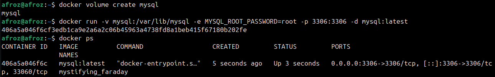
   
3. Add some data, stop and remove the container

   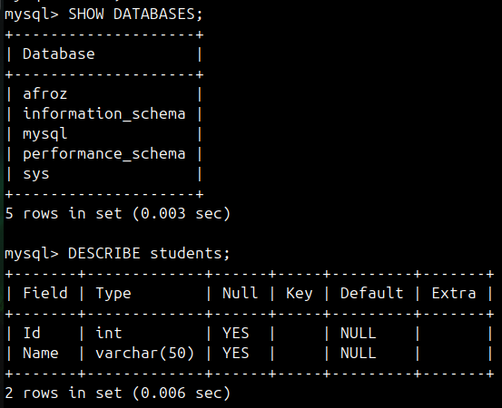
   
4. Run a brand new container with the **same volume**

   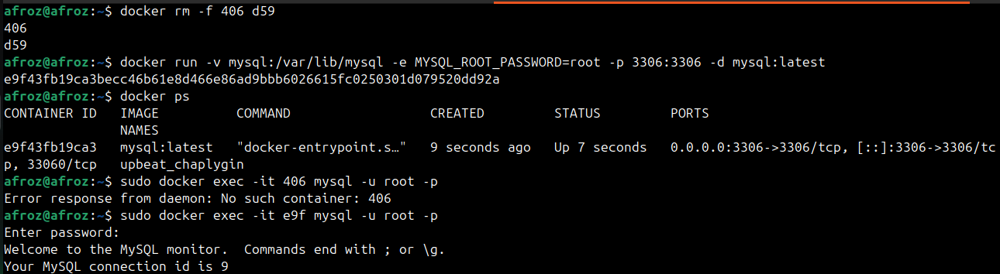
   
5. Is the data still there?

   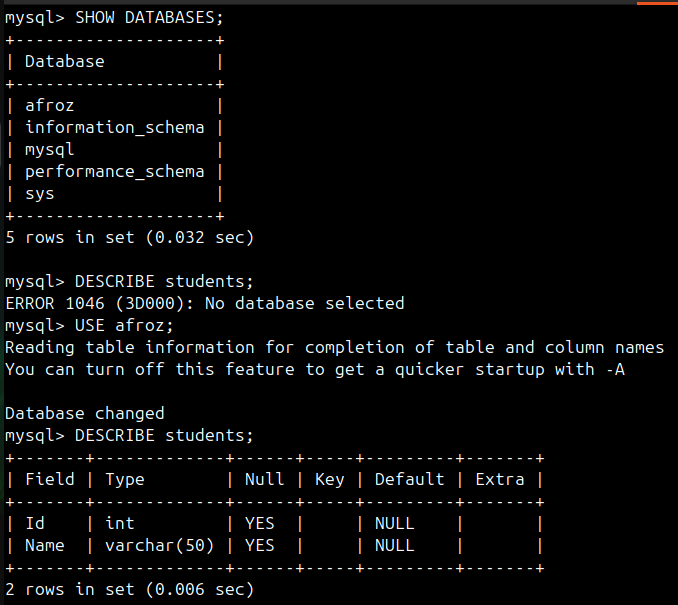

**Verify:** `docker volume ls`, `docker volume inspect`

   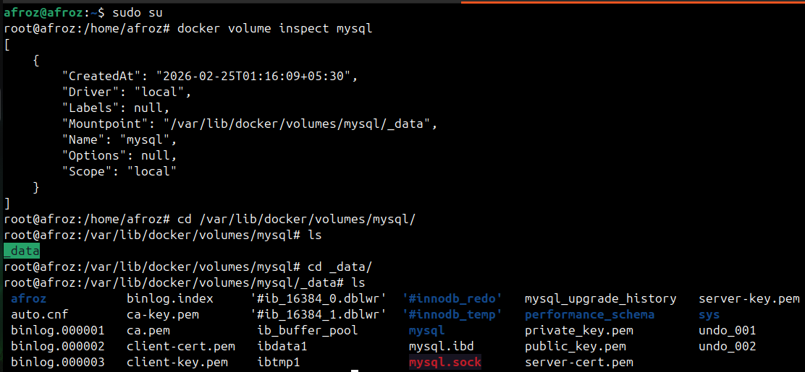
   
---

## Task 3: Bind Mounts
1. Create a folder on your host machine with an `index.html` file

   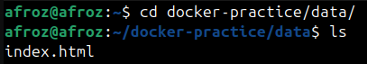
   
2. Run an Nginx container and **bind mount** your folder to the Nginx web directory

   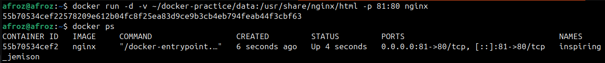
   
3. Access the page in your browser

   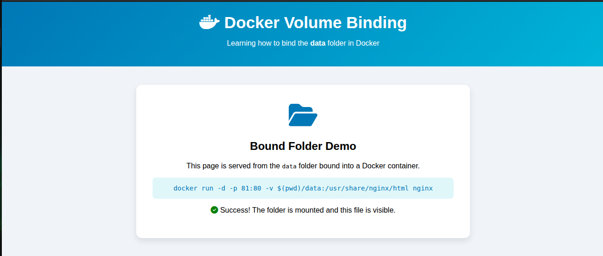
   
4. Edit the `index.html` on your host — refresh the browser

   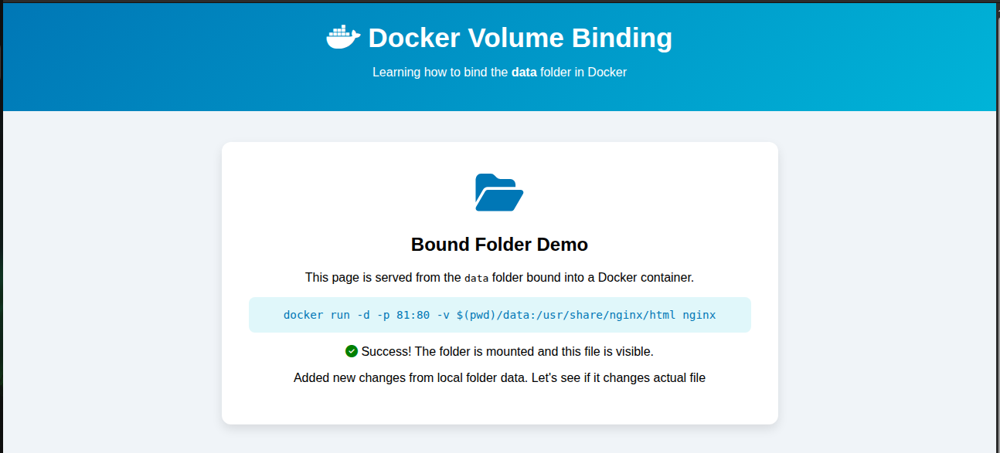
   
* **Named Volume** : They are created and managed by docker. Stored in docker's internal storage directory.
    At initialization if volume is empty it copies container's data. More secure.
* **Bind Mount** : They are created by users. Can be created anywhere in the file system. 
    At initialization if volume is empty it obscure container's data. Less secure.
    
---

## Task 4: Docker Networking Basics
1. List all Docker networks on your machine

   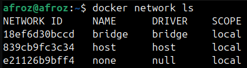
   
2. Inspect the default `bridge` network

   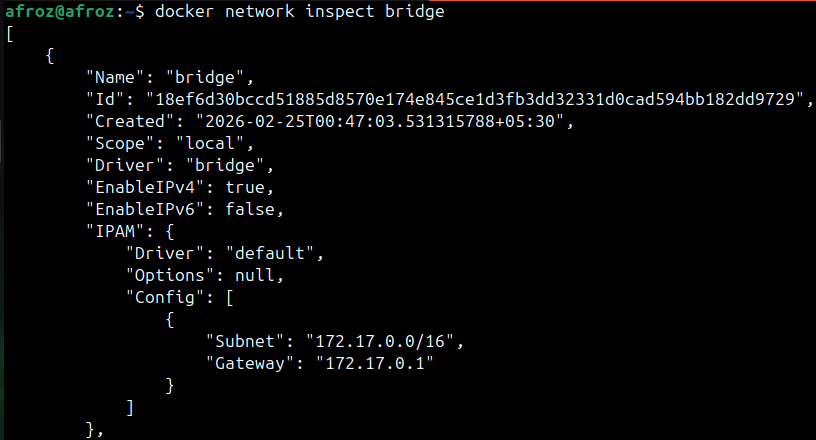
   
3. Run two containers on the default bridge — can they ping each other by **name**?
4. Run two containers on the default bridge — can they ping each other by **IP**?

   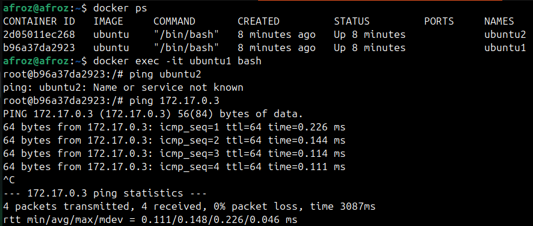
   
* On default bridge containers can't PING each other by **NAME**, But they can PING each other by **IP**.

---

## Task 5: Custom Networks
1. Create a custom bridge network called `my-app-net`

   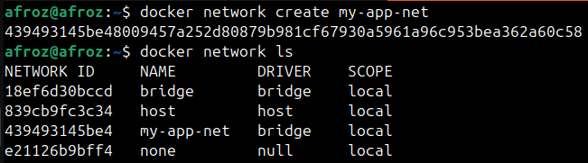
   
2. Run two containers on `my-app-net`

   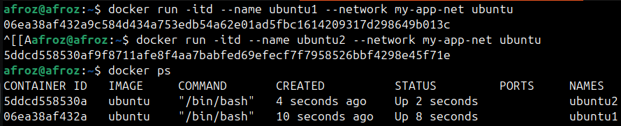
   
3. Can they ping each other by **name** now? **YES**

   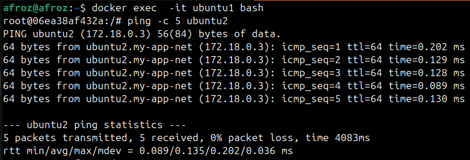
   
4. Write in your notes: Why does custom networking allow name-based communication but the default bridge doesn't?
* Custom networking enables built-in DNS, so container can resolve each other by name.
* Default bridge does not enable built-in DNS, so it can only use IP address to ping.

---

## Task 6: Put It Together
1. Create a custom network
2. Run a **database container** (MySQL/Postgres) on that network with a volume for data
3. Run an **app container** (use any image) on the same network
4. Verify the app container can reach the database by container name

### For this task I am creating a two-tier flask app.
*This is a simple Flask app that interacts with a MySQL database. The app allows users to submit messages, 
 which are then stored in the database and displayed on the frontend.

   [two-tier flask app](two-tier-flask-app)
   
   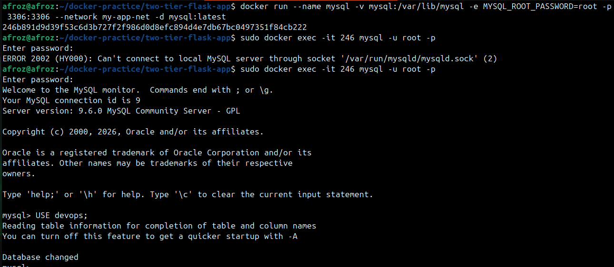
   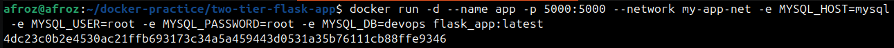
   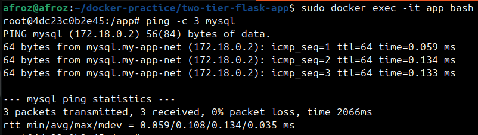
   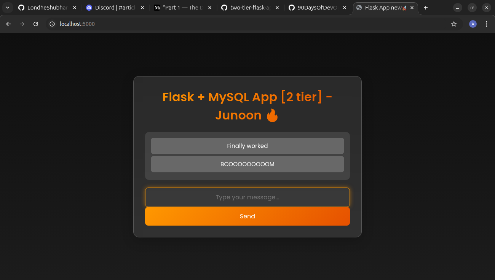
   
---

