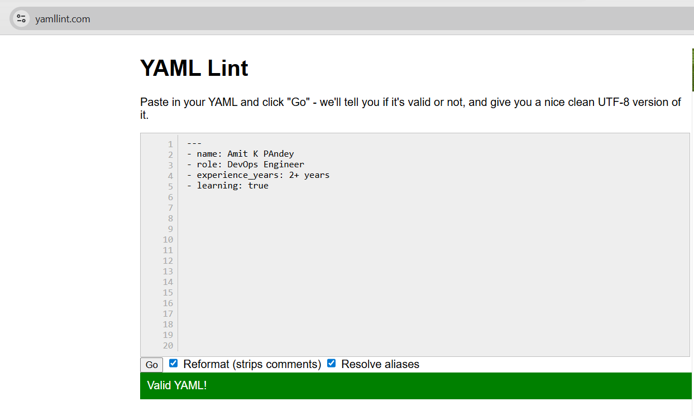
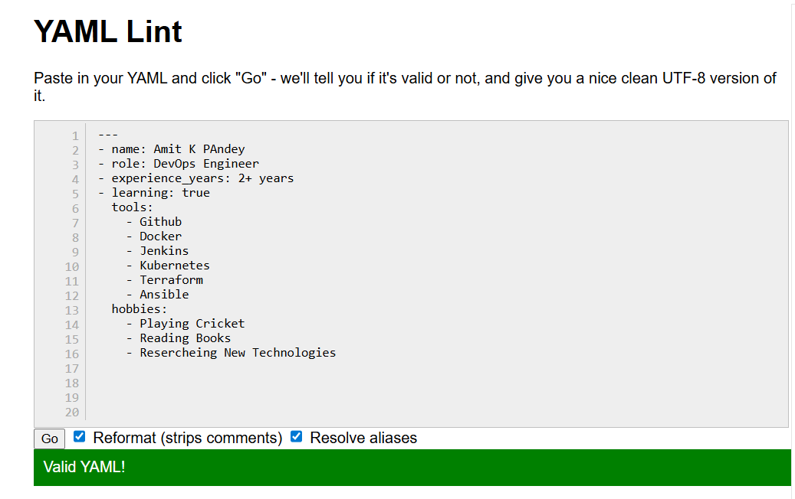
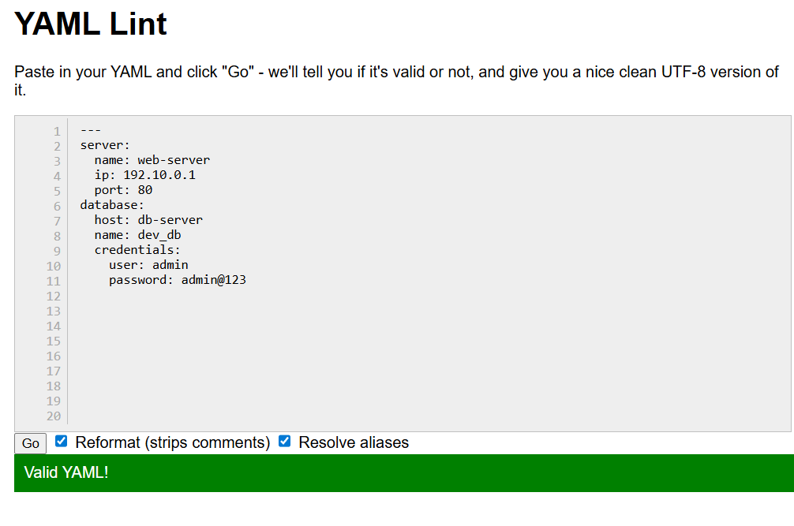
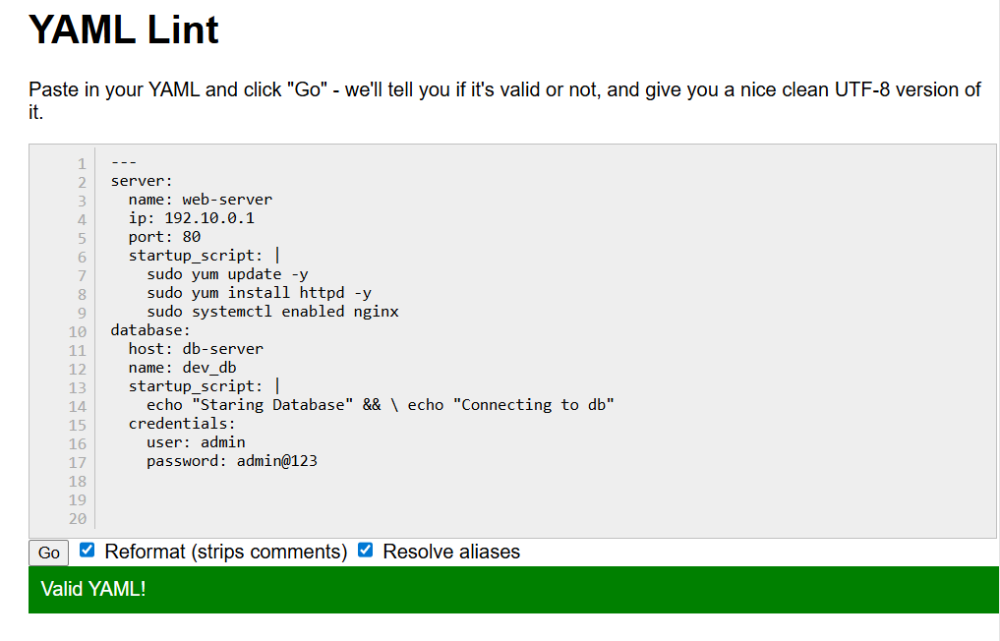
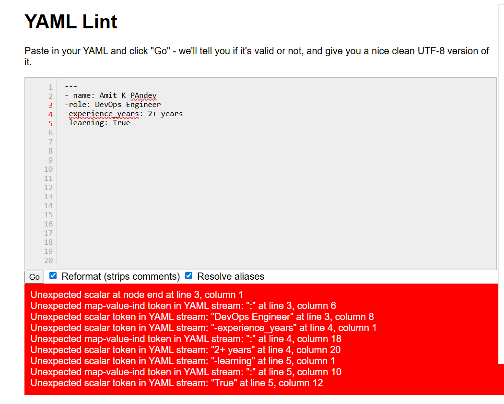
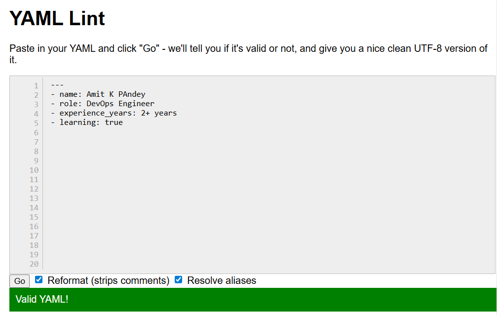

# Day 38 – YAML Basics

## Task
Before writing a single CI/CD pipeline, you need to get comfortable with **YAML** — the language every pipeline is written in.

You will:
- Understand YAML syntax and rules
- Write YAML files by hand
- Validate them

---

## Challenge Tasks

### Task 1: Key-Value Pairs
Create `person.yaml` that describes yourself with:
- `name`
- `role`
- `experience_years`
- `learning` (a boolean)

**Verify:** Run `cat person.yaml` — does it look clean? No tabs?



---

### Task 2: Lists
Add to `person.yaml`:
- `tools` — a list of 5 DevOps tools you know or are learning
- `hobbies` — a list using the inline format `[item1, item2]`

Write in your notes: What are the two ways to write a list in YAML?

- Using - dash

- Using square brackets [ ] inline format



---

### Task 3: Nested Objects
Create `server.yaml` that describes a server:
- `server` with nested keys: `name`, `ip`, `port`
- `database` with nested keys: `host`, `name`, `credentials` (nested further: `user`, `password`)

**Verify:** Try adding a tab instead of spaces — what happens when you validate it?
- Gives wrong indentation error



---

### Task 4: Multi-line Strings
In `server.yaml`, add a `startup_script` field using:
1. The `|` block style (preserves newlines)
2. The `>` fold style (folds into one line)

Write in your notes: When would you use `|` vs `>`?
-  `|` - Use when formatting matters (scripts, commands, exact output) &  `>` - Use when you want cleaner, wrapped text without line breaks



---

### Task 5: Validate Your YAML
1. Install `yamllint` or use an online validator
2. Validate both your YAML files
3. Intentionally break the indentation — what error do you get?
4. Fix it and validate again



- geting error

- Unexpected scalar at node end at line 3, column 1
- Unexpected map-value-ind token in YAML stream: ":" at line 3, column 6
- Unexpected scalar token in YAML stream: "DevOps Engineer" at line 3, column 8
- Unexpected scalar token in YAML stream: "-experience_years" at line 4, column 1
- Unexpected map-value-ind token in YAML stream: ":" at line 4, column 18
- Unexpected scalar token in YAML stream: "2+ years" at line 4, column 20
- Unexpected scalar token in YAML stream: "-learning" at line 5, column 1
- Unexpected map-value-ind token in YAML stream: ":" at line 5, column 10
- Unexpected scalar token in YAML stream: "True" at line 5, column 12

Fixed




---

### Task 6: Spot the Difference
Read both blocks and write what's wrong with the second one:

```yaml
# Block 1 - correct
name: devops
tools:
  - docker
  - kubernetes
```

```yaml
# Block 2 - broken
name: devops
tools:
- docker
  - kubernetes
```
- In Block 2 Wrong indentation for the list item kubernetes


- Correct

# Block 2 - broken
name: devops
tools:
  - docker
  - kubernetes


---

Happy Learning!
**TrainWithShubham**
