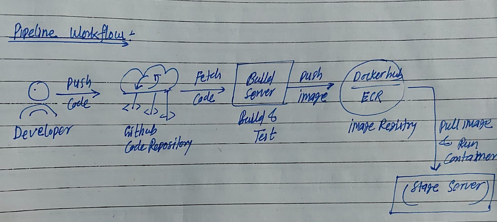

# Day 39 – What is CI/CD?

## Task
Before writing a single pipeline, understand **why CI/CD exists** and what it actually does.

Today is a research and diagram day — no pipelines yet. Get the concepts right first.

---

## Challenge Tasks

### Task 1: The Problem
Think about a team of 5 developers all pushing code to the same repo manually deploying to production.

Write in your notes:
1. What can go wrong?
- Environment mismatches - Production fails because of untracked differences in OS, libs, or configs.
- Conflicts and overwrites - One developer changes get lost when another pushes simultaneously.
- Human errors - Forgetting steps like restarting services or updating configs causes downtime.
- Downtime or broken features if bugs are deployed.
- Difficulty rolling back if a deployment fails.

2. What does "it works on my machine" mean and why is it a real problem?
- This happens when local setups your Ubuntu Docker environment differ from serverse like Python 3.11 locally but 3.9 in production, or missing Redis port forwards.

3. How many times a day can a team safely deploy manually?
- Usually 1-2 times per day max for safety

---

### Task 2: CI vs CD
Research and write short definitions (2-3 lines each):
1. **Continuous Integration** — what happens, how often, what it catches
- What happens: Developers push small code changes multiple times daily. Automated system immediately builds entire app + runs all tests'
- How often: After every push or pull request.
- What it catches: Integration bugs, dependency conflicts, broken builds.

- **Real-world CI example (Hotstar)**:
     - Developers push code daily to the shared repository.
     - Jenkins automatically builds the app and runs tests for video playback, live scores, and UI features.
     - Any failing test triggers immediate feedback, so issues are fixed before merging, keeping Hotstar stable.

2. **Continuous Delivery** — how it's different from CI, what "delivery" means
- Continous integration stops at tests passed. Continous Delivery automates full packaging + deploy to staging environment.
- Delivery means: Docker image built, tagged, pushed to registry, deployed to staging always ready for production with one click manualy.

- **Real-world CD example (Netflix)**:
     - After passing CI tests, Netflix’s CD pipeline deploys the code to a staging environment.
     - With manual approval updates are then released to production,letting new features and fixes reach users safely and quickly.

3. **Continuous Deployment** — how it differs from Delivery, when teams use it
- How it differs from Delivery: No manual approval needed every test pass auto deploys to production immediately.

- **Real-world example (Amazon)**:

     - Amazon deploys code multiple times per day directly to production, ensuring every successful build is live for users almost immediately.

---

### Task 3: Pipeline Anatomy
A pipeline has these parts — write what each one does:

- **Trigger**
    - The event that starts the pipeline.
    - This could be a `code push`,`pull request`,`scheduled time` or `manual action`

- **Stage**
    - A logical phase in the pipeline.
    - Common stages include `build`, `test`and `deploy`. 
    - Stages help organize the workflow and often run in a defined order

- **Job**
    - A unit of work within a stage.
    - Each job runs independently and can contain multiple steps.
    - Example: a "Run Unit Tests" job inside the Test stage.

- **Steps**
    - A single command or action inside a job.
    - Steps are the building blocks of jobs like running a script,installing dependencies or executing tests.

- **Runner**
    - The machine (physical or virtual) that executes the job.
    - Runners provide the environment where all steps of a job actually run.
    - every Jobs Needs a Runner (run-on for every job)

- **Artifact**
    - Any output produced by a job
    - The files or packages produced by a job (like a `.jar` file or `Docker image`) that are passed to later stages or saved for release.

---

### Task 4: Draw a Pipeline
Draw a CI/CD pipeline for this scenario:
> A developer pushes code to GitHub. The app is tested, built into a Docker image, and deployed to a staging server.

 

Include at least 3 stages. Hand-drawn and photographed is perfectly fine.

- A developer pushes code to GitHub. The app is tested, built into a Docker image, and deployed to a staging server

---

### Task 5: Explore in the Wild
1. Open any popular open-source repo on GitHub (Kubernetes, React, FastAPI — pick one you know)
2. Find their `.github/workflows/` folder
3. Open one workflow YAML file
4. Write in your notes:

[fastAPI-workflow](https://github.com/Amit5197/fastapi/blob/master/.github/workflows/build-docs.yml)

   - What triggers it?
      - Whenever push to master branch
      - Wheneversomeone pushes new commit to Pull request
   
   - How many jobs does it have?
      - 4 jobs [changes, langs, build-docs, docs-all-green]
   
   - What does it do? (best guess)
      - changes- Tracked the changes of Documentaion file
      - langs- Detect languages to build
      - Builds- the documentation site for each language
      - docs-all-green- check the pipeline is successed or not

---

Happy Learning!
**TrainWithShubham**
