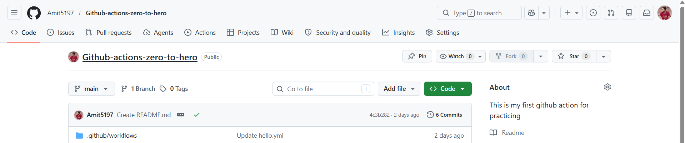

# Day 40 – Your First GitHub Actions Workflow

## Task
Today you write your **first GitHub Actions pipeline** and watch it run in the cloud.

This is the moment CI/CD stops being a concept and becomes real.

---

## Challenge Tasks

### Task 1: Set Up
1. Create a new **public** GitHub repository called `github-actions-practice`
2. Clone it locally
3. Create the folder structure: `.github/workflows/`



---

### Task 2: Hello Workflow
Create `.github/workflows/hello.yml` with a workflow that:
1. Triggers on every `push`
2. Has one job called `greet`
3. Runs on `ubuntu-latest`
4. Has two steps:
   - Step 1: Check out the code using `actions/checkout`
   - Step 2: Print `Hello from GitHub Actions!`

Push it. Go to the **Actions** tab on GitHub and watch it run.

**Verify:** Is it green? Click into the job and read every step.

- Yes,it is green


---

### Task 3: Understand the Anatomy
Look at your workflow file and write in your notes what each key does:
- `on:`
   - Defines `when the worflow is triggered`
   - It listen for event `push`

- `jobs:`
   - Defines the jobs that the worflow will execute
   - A `workflow` can have one or multiple jobs

- `runs-on:`
   - Specifies the virtual machine(runner) env the job will use.
   - `ubuntu-latest`,`windows-latest`,`macos-latest`

- `steps:`
   - Defines the sequences of actions the job will execute
   - Steps run one after another inside the job.

- `uses:`
   - Tells Github to use a prebuilt action
   - Checkout action to clone the repo.

- `run:`
   - Executes commands directly on the runner

- `name:` (on a step)
   - This is the name of the workflow
   - Give the step a humand readable label in the Actions UI.
---

### Task 4: Add More Steps
Update `hello.yml` to also:

1. Print the current date and time
```
- name: Print current date and time
  run: date
```

2. Print the name of the branch that triggered the run (hint: GitHub provides this as a variable)
```
- name: Print branch name
  run: echo "Branch name is ${{ github.ref_name }}**
```

3. List the files in the repo
```
- name: List repository files
  run: ls -la
```

4. Print the runner's operating system
```
- name: runner operating system
  run: echo "Runner OS is $RUNNER_OS"
```

Push again — watch the new run.


---

### Task 5: Break It On Purpose
1. Add a step that runs a command that will **fail** (e.g., `exit 1` or a misspelled command)
2. Push and observe what happens in the Actions tab
3. Fix it and push again

Write in your notes: What does a failed pipeline look like? How do you read the error?

- Error


- Fix


---

Happy Learning!
**TrainWithShubham**
