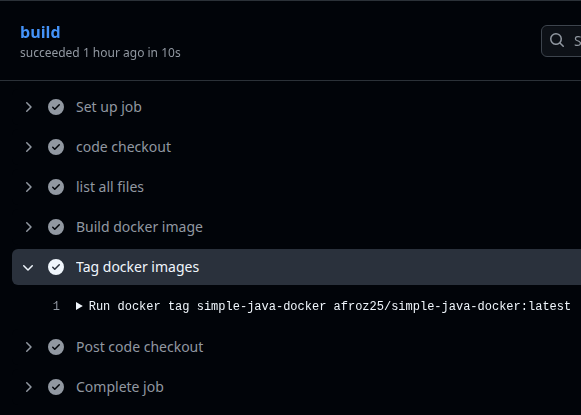
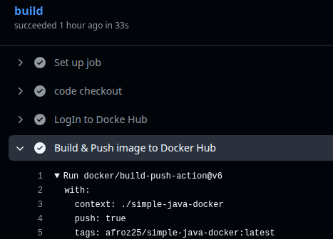
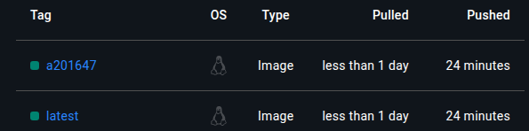
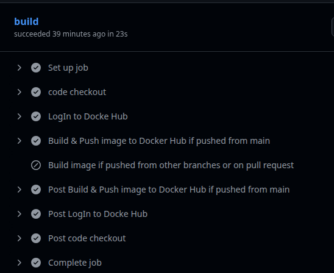
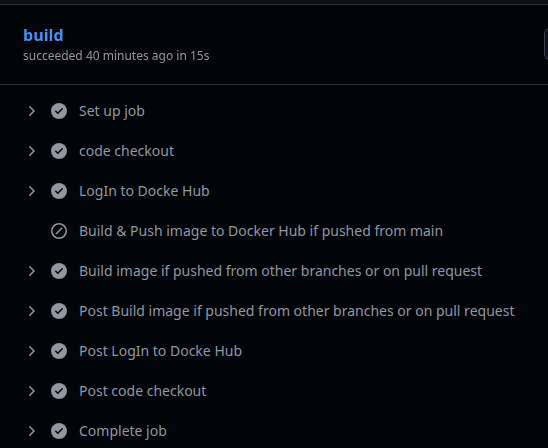
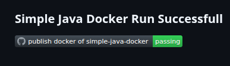

# Day 45 – Docker Build & Push in GitHub Actions    

## Task 1: Prepare
1. Use the app you Dockerized on Day 36 (or any simple Dockerfile)
2. Add the Dockerfile to your `github-actions-practice` repo (or create a minimal one)
3. Make sure `DOCKER_USERNAME` and `DOCKER_TOKEN` secrets are set from Day 44

**DONE**

---

## Task 2: Build the Docker Image in CI
Create `.github/workflows/docker-publish.yml` that:
1. Triggers on push to `main`
2. Checks out the code
3. Builds the Docker image and tags it

**Verify:** Check the build step logs — does the image build successfully?

   [docker publish yml file](https://github.com/Afroz-J-Shaikh/github-actions-practice/blob/ccb70154dadc82958e819f3566088c32de8ba8e6/.github/workflows/simple-docker-publish.yml)

   

---

## Task 3: Push to Docker Hub
Add steps to:
1. Log in to Docker Hub using your secrets
2. Tag the image as `username/repo:latest` and also `username/repo:sha-<short-commit-hash>`
3. Push both tags

**Verify:** Go to Docker Hub — is your image there with both tags? **YES**

   

   

---

# Task 4: Only Push on Main
Add a condition so the push step only runs on the `main` branch — not on feature branches or PRs.

Test it: push to a feature branch and verify the image is built but NOT pushed.

   * Only ran pushed from main step

   

   * Only ran pushed from anywhere except main, it has push:false

   

---

## Task 5: Add a Status Badge
1. Get the badge URL for your `docker-publish` workflow from the Actions tab
2. Add it to your `README.md`
3. Push — the badge should show green

   

---

## Task 6: Pull and Run It
1. On your local machine (or a cloud server), pull the image you just pushed
2. Run it
3. Confirm it works

   [DockerHub Link](https://hub.docker.com/repositories/afroz25)

   * Runninf successfully after pulling image from DockerHub

   

Write in your notes: What is the full journey from `git push` to a running container?
* After git push the github action is triggered and the workflow runs.
* In GitHub workflow 
  - The code is checked out
     - uses: actions/checkout@v4
  - LogIn to DockerHub using secrets and variables
     - uses: docker/login-action@v3
  - Code is Build, Tagged & Pushed to DockerHub
     - ```uses: docker/build-push-action@v6
        with:
          context: ./simple-java-docker
          push: true
          tags: |
            ${{ vars.DOCKER_USERNAME }}/simple-java-docker:latest
            ${{ vars.DOCKER_USERNAME }}/simple-java-docker:${{ env.SHORT_SHA }}
       ```
  - You can pull the image on your local or cloud server and run
     - docker pull afroz25/simple-java-docker:latest
     - docker run afroz25/simple-java-docker:latest
---