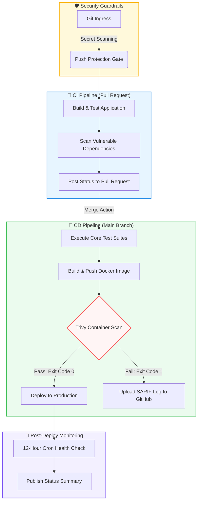

# Day 49 – DevSecOps: Add Security to Your CI/CD Pipeline

## Task
You can build and deploy automatically. But what if your Docker image has a known vulnerability? What if someone accidentally commits a password? Today you learn **DevSecOps** — adding simple, automated security checks to your pipeline so problems are caught **before** they reach production.

Don't worry — this isn't a security course. You're just adding a few smart steps to the pipeline you already built.

---

## What is DevSecOps?
- DevSecOps is aprocess of integrating security in every stage of your CI/CD pipeline. Instead of cathing vulnerabilities late in production, DevSecOps insures they are identified and fixed early in CI/CD pipelines.

Think of it like this:

**Without DevSecOps:**
> You build the app → deploy it → a security team finds a vulnerability weeks later → you scramble to fix it

**With DevSecOps:**
> You open a PR → the pipeline automatically checks for vulnerabilities → you fix it before it ever gets merged

**That's it.** DevSecOps = adding security checks to the pipeline you already have. Not a separate process — just a few extra steps.

---

## Key Principles (Keep These in Mind)

1. **Catch problems early** — A vulnerability found in a PR takes 5 minutes to fix. The same vulnerability found in production takes days.

2. **Automate the checks** — Don't rely on someone remembering to check. Let the pipeline do it every time.

3. **Block on critical issues** — If a scan finds a serious vulnerability, the pipeline should fail — just like a failing test.

4. **Never put secrets in code** — Use GitHub Secrets (you learned this on Day 44). No `.env` files, no hardcoded API keys.

5. **Give only the access needed** — Your workflow doesn't need write access to everything. Limit permissions.

---

## Challenge Tasks

### Task 1: Scan Your Docker Image for Vulnerabilities
Your Docker image might use a base image with known security issues. Let's find out.

Add this step to your main branch pipeline (after Docker build, before deploy):
```yaml
- name: Scan Docker Image for Vulnerabilities
  uses: aquasecurity/trivy-action@master
  with:
    image-ref: 'your-username/your-app:latest'
    format: 'table'
    exit-code: '1'
    severity: 'CRITICAL,HIGH'
```

What this does:
- `trivy` scans your Docker image for known CVEs (Common Vulnerabilities and Exposures)
- `format: 'table'` prints a readable table in the logs
- `exit-code: '1'` means **fail the pipeline** if CRITICAL or HIGH vulnerabilities are found
- If it passes, your image is clean — proceed to push and deploy

Push and check the Actions tab. Read the scan output.

**Verify:** Can you see the vulnerability table in the logs? Did it pass or fail?

- Trivy Scan Passed


Write in your notes: What CVEs (if any) were found? What base image are you using?
- There were 11 critical issues,mainly coming from dependencies in the base image Node.js 20 and underlying Alpine Linux packages.
- To fix this, the base image was upgraded to Node.js 22 and system packages were updated to patched versions.

---

### Task 2: Enable GitHub's Built-in Secret Scanning
GitHub can automatically detect if someone pushes a secret (API key, token, password) to your repo.

1. Go to your repo → Settings → **Code security and analysis**
2. Enable **Secret scanning**
3. If available, also enable **Push protection** — this blocks the push entirely if a secret is detected

That's it — no workflow changes needed. GitHub does this automatically.


Write in your notes:

- What is the difference between secret scanning and push protection?
   - `Secret Scanning`:
      - It scans your entire repository for know secret patterns.
      - It idefntifies secrets after they have been commited to the repository and generates
        alerts in the security tab of the repository.
   - `Push protection` :
      - It aims to stop secrets fron entering your codebase in the first place.
      - It scans the code for secrets in real time during the `git push` process.
      - If a secret is detected, then push is blocked and developer receives error message 
        and remediation guidance 

- What happens if GitHub detects a leaked AWS key in your repo?
   -  When secret scanning finds a potential secret, GitHub generates an alert on your 
      repository's Security tab with details about the exposed credential.

---

### Task 3: Scan Dependencies for Known Vulnerabilities
If your app uses packages (pip, npm, etc.), those packages might have known vulnerabilities.

Add this to your **PR pipeline** (not the main pipeline):
```yaml
- name: Check Dependencies for Vulnerabilities
  uses: actions/dependency-review-action@v4
  with:
    fail-on-severity: critical
```

This checks any **new** dependencies added in the PR against a vulnerability database. If a dependency has a critical CVE, the PR check fails.

Test it:
1. Open a PR that adds a package to your app
2. Check the Actions tab — did the dependency review run?

**Verify:** Does the dependency review show up as a check on your PR?

---

### Task 4: Add Permissions to Your Workflows
By default, workflows get broad permissions. Lock them down.

Add this block near the top of your workflow files (after `on:`):
```yaml
permissions:
  contents: read
```

If a workflow needs to comment on PRs, add:
```yaml
permissions:
  contents: read
  pull-requests: write
```

Update at least 2 of your existing workflow files with a `permissions` block.

Write in your notes: Why is it a good practice to limit workflow permissions? What could go wrong if a compromised action has write access to your repo?
* **Security** : If a workflow gets compromised, you don’t want it to have full control over your repo. Limiting permissions reduces risk.
   * If a compromised action has write access, it can modify, delete your code, steal
     secrets.

### **Note** : In March 2026, GitHub experienced a large-scale bot attack (HackerBot-Claw) that exploited insecure GitHub Actions workflows. To prevent similar compromises, always configure minimal workflow permissions and enable dependency graph + security analysis features.

🛡️ Your Workflow Security Baseline
- Granular Token Permissions: Your workflow explicitly drops broad default access by setting permissions: contents: read and restricting write privileges strictly to security-events: write (required purely for publishing your Trivy SARIF results). Even if an external exploit executes inside a step, the runtime token lacks the authority to modify repository source code or configurations.

- Automated Dependency Guardrails: Enabling Secret Scanning and Push Protection directly at the repository gateway prevents hardcoded credentials from accidentally entering your history, neutralizing automated bot scrapers trying to harvest leaked tokens.

- Container Auditing Gates: Incorporating Trivy Image Vulnerability Scanning as a blocking step (exit-code: 1) guarantees that high-risk or outdated system libraries are caught and contained before they reach your runtime systems

---

### Task 5: See the Full Secure Pipeline
Look at what your pipeline does now:

```
PR opened
  → build & test
  → dependency vulnerability check     ← NEW (Day 49)
  → PR checks pass or fail

Merge to main
  → build & test
  → Docker build
  → Trivy image scan (fail on CRITICAL) ← NEW (Day 49)
  → Docker push (only if scan passes)
  → deploy

Always active
  → GitHub secret scanning              ← NEW (Day 49)
  → push protection for secrets         ← NEW (Day 49)
```

Draw this diagram in your notes. You just built a **DevSecOps pipeline** — security is now part of your automation, not an afterthought.


---

## Brownie Points (Optional — For the Curious)

### Pin Actions to Commit SHAs
Tags like `@v4` can be moved by the action author. For extra security, pin to the exact commit:
```yaml
# Instead of this:
uses: actions/checkout@v4

# Use this:
uses: actions/checkout@b4ffde65f46336ab88eb53be808477a3936bae11 # v4.1.1
```
This protects against supply chain attacks where a tag is silently changed.

### Upload Scan Results to GitHub Security Tab
Add SARIF output to Trivy and upload it — your scan results will appear in the repo's **Security** tab:
```yaml
- uses: aquasecurity/trivy-action@master
  with:
    image-ref: 'your-username/your-app:latest'
    format: 'sarif'
    output: 'trivy-results.sarif'
- uses: github/codeql-action/upload-sarif@v3
  with:
    sarif_file: 'trivy-results.sarif'
```


### What you learned about secret scanning and dependency review
- **Secret Scanning** : It detects sensitive data accidently pushed to your repo. Preventing leaks.
- **Dependency review** : It analyzes project libraries to catch vulnerabilities, outdated packages, or risky changes before they’re merged.---

---

### Capstone Project link

[Capstone Project link](https://github.com/Amit5197/github-actions-capstone)

### Full Main Pipeline


---

### Learn About OIDC (Keyless Authentication)
Instead of storing cloud credentials as long-lived secrets, GitHub Actions can use OIDC to get short-lived tokens automatically. Research: "GitHub Actions OIDC" — it's how production pipelines authenticate to AWS, GCP, and Azure without storing any keys.

Why Production Environments Require OIDC
Zero Secret Management Overhead: There are no API keys to rotate every 90 days, and there is zero risk of an engineer accidentally exposing a permanent cloud key in a build log or public repository.

Granular Least Privilege: You can configure your cloud provider to only trust tokens originating from a specific environment, tag, or branch. For example, your production deployment role can be locked down so it refuses connections unless the token proves the run originated from a protected main branch.

Automated Expiry: Because the credentials expire automatically after a short window, even if a running container is somehow compromised during execution, the stolen token becomes completely useless shortly after.

```
name: Deploy with OIDC

on:
  push:
    branches: [main]

permissions:
  id-token: write # 🔑 CRITICAL: Required to request the JWT from GitHub
  contents: read  # Required to checkout the repository code

jobs:
  deploy:
    runs-on: ubuntu-latest
    steps:
      - name: Checkout Code
        uses: actions/checkout@v4

      # 🛡️ Authenticate dynamically using OIDC instead of long-lived secrets
      - name: Configure AWS Credentials
        uses: aws-actions/configure-aws-credentials@v4
        with:
          role-to-assume: arn:aws:iam::123456789012:role/my-github-actions-oidc-role
          aws-region: us-east-1
          # No secrets.AWS_ACCESS_KEY_ID needed! 
          # The action automatically handles the OIDC token exchange exchange behind the scenes.

      - name: Deploy Infrastructure
        run: |
          aws s3 sync ./dist s3://my-production-bucket-name
```
### How OIDC Works (The Trust Handshake)
- Instead of passing a static password, GitHub acts as a trusted identity provider. The authentication follows a strict cryptographic handshake:
- The Trigger: A workflow runs on GitHub.

- The Request: The GitHub Actions runner requests an OIDC token from GitHub's internal token service. GitHub generates a unique JWT (JSON Web Token) containing metadata about the specific run (repository, workflow name, branch, actor).
- The Handshake: The runner sends this JWT straight to your cloud provider (e.g., AWS, GCP, Azure).
- The Validation: The cloud provider validates the signature of the token against GitHub's public keys and checks your configured Trust Policy (e.g., "Only allow tokens coming from repository my-org/my-app on the main branch").
- The Access: If the metadata matches, the cloud provider issues a temporary, scoped IAM security token (typically valid for 15 to 60 minutes) to the runner, allowing it to deploy resources.

---

## Learn in Public
Share your pipeline diagram on LinkedIn — "My CI/CD pipeline now scans for vulnerabilities automatically." Simple, powerful, and impressive.

`#90DaysOfDevOps` `#DevOpsKaJosh` `#TrainWithShubham`

Happy Learning!
**TrainWithShubham**
