# Day 54 – Kubernetes ConfigMaps and Secrets

## Task 1: Create a ConfigMap from Literals
1. Use `kubectl create configmap` with `--from-literal` to create a ConfigMap called `app-config` with keys `APP_ENV=production`, `APP_DEBUG=false`, and `APP_PORT=8080`
2. Inspect it with `kubectl describe configmap app-config` and `kubectl get configmap app-config -o yaml`
3. Notice the data is stored as plain text — no encoding, no encryption

**Verify:** Can you see all three key-value pairs?

   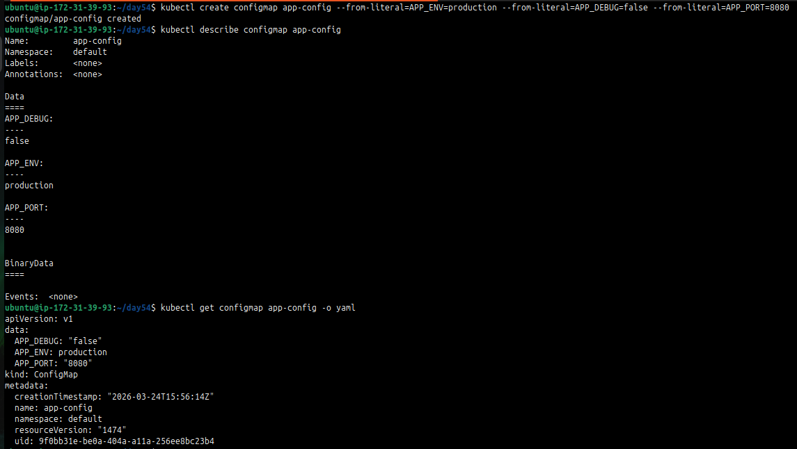

---

## Task 2: Create a ConfigMap from a File
1. Write a custom Nginx config file that adds a `/health` endpoint returning "healthy"
2. Create a ConfigMap from this file using `kubectl create configmap nginx-config --from-file=default.conf=<your-file>`
3. The key name (`default.conf`) becomes the filename when mounted into a Pod

**Verify:** Does `kubectl get configmap nginx-config -o yaml` show the file contents?

   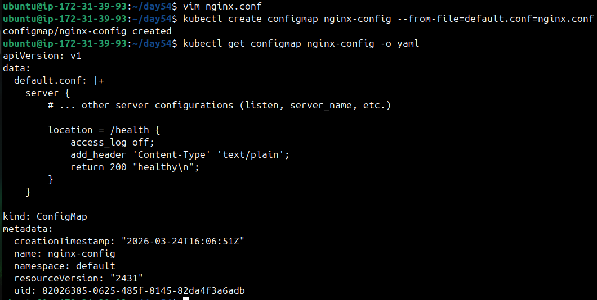

---

## Task 3: Use ConfigMaps in a Pod
1. Write a Pod manifest that uses `envFrom` with `configMapRef` to inject all keys from `app-config` as environment variables. Use a busybox container that prints the values.

   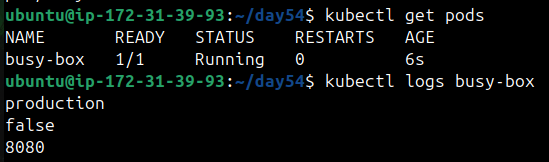

2. Write a second Pod manifest that mounts `nginx-config` as a volume at `/etc/nginx/conf.d`. Use the nginx image.
3. Test that the mounted config works: `kubectl exec <pod> -- curl -s http://localhost/health`

   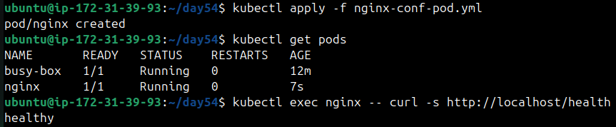

Use environment variables for simple key-value settings. Use volume mounts for full config files.

**Verify:** Does the `/health` endpoint respond? **YES**

---

## Task 4: Create a Secret
1. Use `kubectl create secret generic db-credentials` with `--from-literal` to store `DB_USER=admin` and `DB_PASSWORD=s3cureP@ssw0rd`
2. Inspect with `kubectl get secret db-credentials -o yaml` — the values are base64-encoded
3. Decode a value: `echo '<base64-value>' | base64 --decode`

   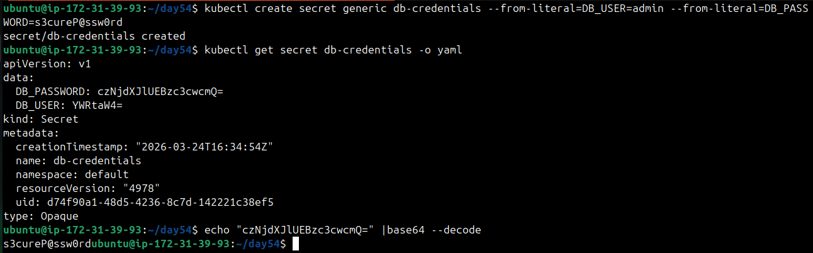

**base64 is encoding, not encryption.** Anyone with cluster access can decode Secrets. The real advantages are RBAC separation, tmpfs storage on nodes, and optional encryption at rest.

**Verify:** Can you decode the password back to plaintext? **YES**

---

## Task 5: Use Secrets in a Pod
1. Write a Pod manifest that injects `DB_USER` as an environment variable using `secretKeyRef`
2. In the same Pod, mount the entire `db-credentials` Secret as a volume at `/etc/db-credentials` with `readOnly: true`
3. Verify: each Secret key becomes a file, and the content is the decoded plaintext value

   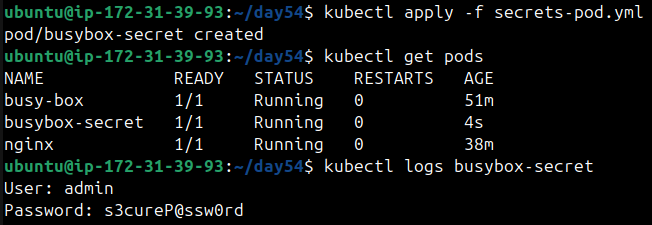

   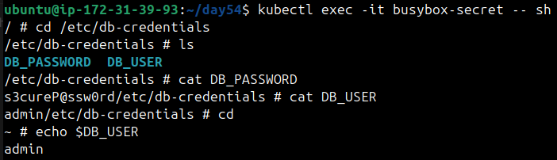

**Verify:** Are the mounted file values plaintext or base64? **Plain Text**

---

## Task 6: Update a ConfigMap and Observe Propagation
1. Create a ConfigMap `live-config` with a key `message=hello`

   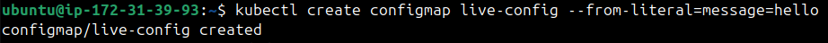

2. Write a Pod that mounts this ConfigMap as a volume and reads the file in a loop every 5 seconds

   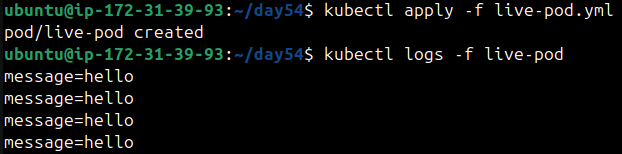
   
3. Update the ConfigMap: `kubectl patch configmap live-config --type merge -p '{"data":{"message":"world"}}'`
4. Wait 30-60 seconds — the volume-mounted value updates automatically

   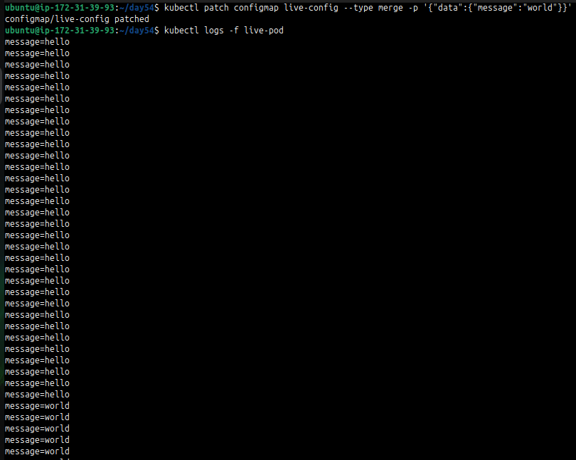

5. Environment variables from earlier tasks do NOT update — they are set at pod startup only

**Verify:** Did the volume-mounted value change without a pod restart? **YES**

---

## Task 7: Clean Up
Delete all pods, ConfigMaps, and Secrets you created.

   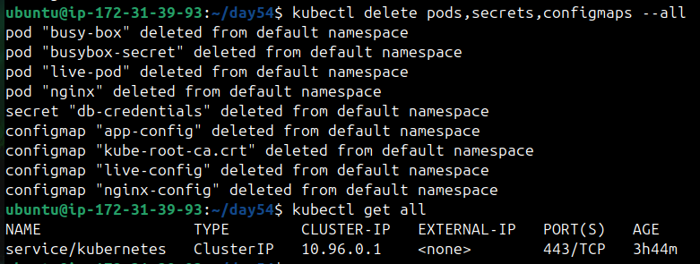

---

- What ConfigMaps and Secrets are and when to use each
   *  Passing configuration into Pods without hardcoding values in your manifests or code.
   * `ConfigMaps` are used for non-sensitive config and `Secrets` for sensitive data.

- The difference between environment variables and volume mounts

| Enviroment Variables | Volume Mounts |
|----------------------|---------------|
| Injected into the container at Pod startup. Values come from ConfigMaps, Secrets, or literals. | Mount ConfigMaps or Secrets as files inside the container’s filesystem. |
| Once the Pod is running, the environment variables don’t change, even if the underlying ConfigMap or Secret is updated. | Kubernetes keeps the mounted files in sync with the latest values. |
| To pick up new values, you need to restart/redeploy the Pod. | If the ConfigMap or Secret changes, the mounted file is updated automatically. |
| Best for small, fixed values (ex. DB_HOST=db.example.com ) | Best for larger configs, certificates, or values that may change at runtime. |

- Why base64 is encoding, not encryption
   * Because it is not secure.
   * It doesn't need key to be decoded'
   * Data is base64 only for safe storage in YAML, anyone with access can decode.

- How ConfigMap updates propagate to volumes but not env vars
   * `ConfigMap as volumes` updates automatically without restart.
   * `ConfigMap as env vars` needs to restart pod to update.

---
