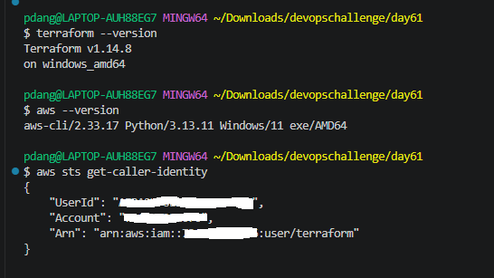
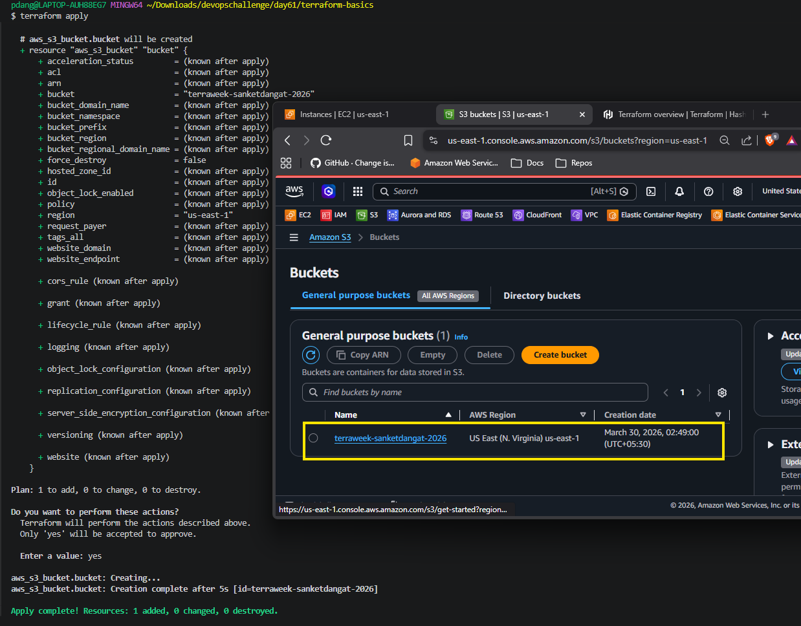
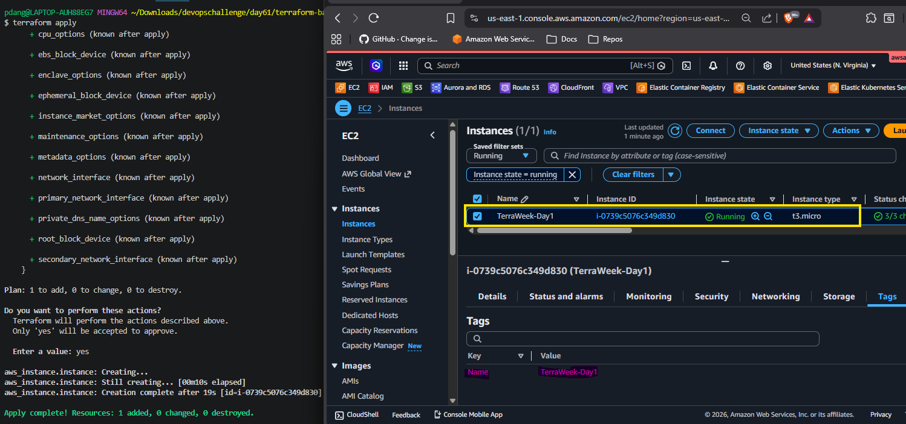
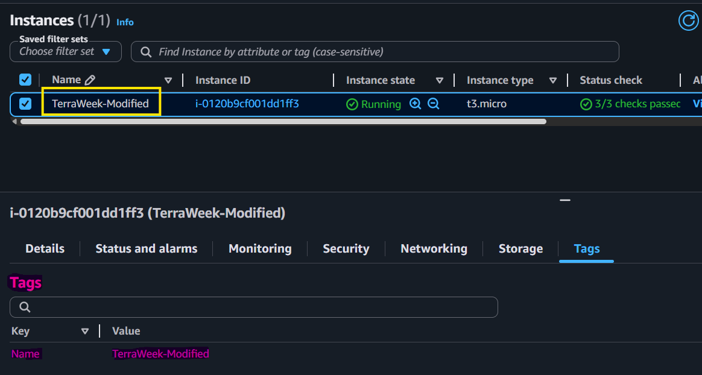
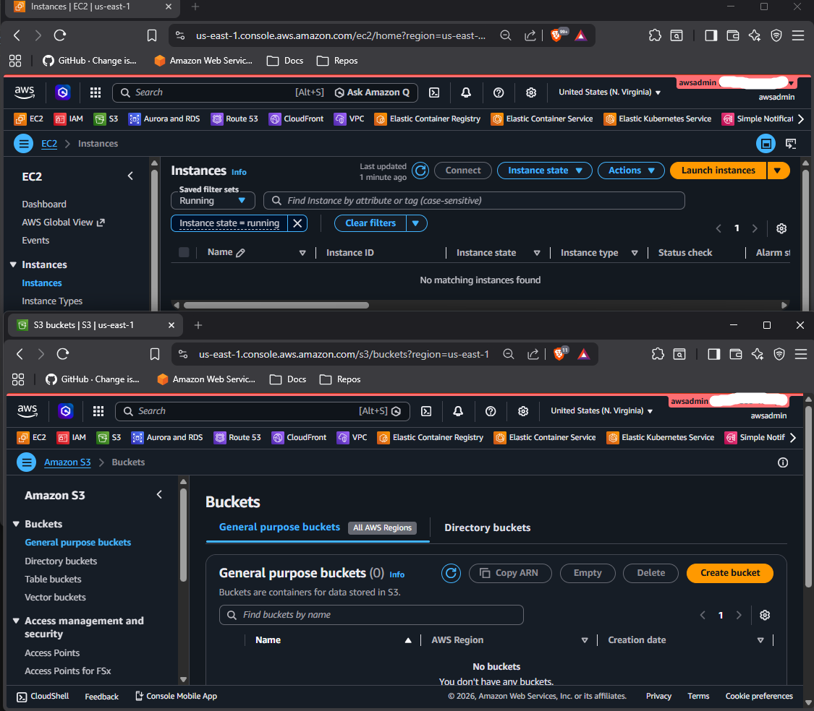

# Day 61 -- Introduction to Terraform and Your First AWS Infrastructure
---
## Challenge Tasks

### Task 1: Understand Infrastructure as Code
Before touching the terminal, research and write short notes on:

1. What is Infrastructure as Code (IaC)? Why does it matter in DevOps?

- Infrastructure as Code means you define your infrastructure (servers,networks,databases,IAM etc.) using code instead of clicking around in a UI.
- DevOps is about working fast and avoiding mistakes.
- IaC helps by automating how infrastructure is created, making it easy to undo changes, and keeping all environments the same.
- Without IaC, everything has to be done manually, which is slower and riskier.

2. What problems does IaC solve compared to manually creating resources in the AWS console?

- Compared to manual AWS console work,IaC provides automation, consistency, version control and the ability to recreate infrastructure easily.

3. How is Terraform different from AWS CloudFormation, Ansible, and Pulumi?

- Terraform is multi-cloud,while CloudFormation is AWS-only,Ansible is mainly for configuration and Pulumi uses programming languages instead of Terraform’s HCL.

4. What does it mean that Terraform is "declarative" and "cloud-agnostic"?

`Terraform is both:`
- `Declarative` You state the desired infrastructure state, and Terraform figures out the steps to reach it.
-	`Cloud‑agnostic` It works across multiple cloud providers (AWS, Azure, GCP, etc.) using the same language and workflow.


---

### Task 2: Install Terraform and Configure AWS
1. Install Terraform:
```bash
# macOS
brew tap hashicorp/tap
brew install hashicorp/tap/terraform

# Linux (amd64)
wget -O - https://apt.releases.hashicorp.com/gpg | sudo gpg --dearmor -o /usr/share/keyrings/hashicorp-archive-keyring.gpg
echo "deb [signed-by=/usr/share/keyrings/hashicorp-archive-keyring.gpg] https://apt.releases.hashicorp.com $(lsb_release -cs) main" | sudo tee /etc/apt/sources.list.d/hashicorp.list
sudo apt update && sudo apt install terraform

# Windows
choco install terraform
```

2. Verify:
```bash
terraform -version
```

3. Install and configure the AWS CLI:
```bash
aws configure
# Enter your Access Key ID, Secret Access Key, default region (e.g., ap-south-1), output format (json)
```

4. Verify AWS access:
```bash
aws sts get-caller-identity
```

You should see your AWS account ID and ARN.


---

### Task 3: Your First Terraform Config -- Create an S3 Bucket
Create a project directory and write your first Terraform config:

```bash
mkdir terraform-basics && cd terraform-basics
```

Create a file called `main.tf` with:
1. A `terraform` block with `required_providers` specifying the `aws` provider
2. A `provider "aws"` block with your region
3. A `resource "aws_s3_bucket"` that creates a bucket with a globally unique name

Run the Terraform lifecycle:
```bash
terraform init      # Download the AWS provider
terraform plan      # Preview what will be created
terraform apply     # Create the bucket (type 'yes' to confirm)
```

Go to the AWS S3 console and verify your bucket exists.



**Document:** What did `terraform init` download? What does the `.terraform/` directory contain?

`terrafrom init` is a CLI command that initializes the Terraform environment by installing the necessary provider plugins and modules and setting up the configuration according to your code.

`.terraform/` directory contains: downloaded provider plugins


---

### Task 4: Add an EC2 Instance
In the same `main.tf`, add:
1. A `resource "aws_instance"` using AMI `ami-0f5ee92e2d63afc18` (Amazon Linux 2 in ap-south-1 -- use the correct AMI for your region)
2. Set instance type to `t2.micro`
3. Add a tag: `Name = "TerraWeek-Day1"`

Run:
```bash
terraform plan      # You should see 1 resource to add (bucket already exists)
terraform apply
```

Go to the AWS EC2 console and verify your instance is running with the correct name tag.



**Document:** How does Terraform know the S3 bucket already exists and only the EC2 instance needs to be created?

- Terraform uses the `state file` to track existing resources.
- Since the S3 bucket is already in the state, Terraform `doesn’t recreate it`.
- The `EC2 instance is not in the state`, so Terraform plans to create it.

---

### Task 5: Understand the State File
Terraform tracks everything it creates in a state file. Time to inspect it.

1. Open `terraform.tfstate` in your editor -- read the JSON structure
2. Run these commands and document what each returns:
```bash
terraform show                          # Human-readable view of current state
terraform state list        # List all resources Terraform manages
terraform state show aws_s3_bucket.<name>   # Detailed view of a specific resource
terraform state show aws_instance.<name>
```

1. `terraform show`
- Displays the full current state in a human-readable format.
- It shows detailed information about all managed resources, including:
   - `EC2 instance (ID, state, IPs, tags, etc.)`
   - `S3 bucket (name, ARN, region, configuration)`

2. `terraform state list`
- Lists all resources tracked in the Terraform state.
   - `Output shows:`  
      `aws_instance.example`
      `aws_s3_bucket.bucket`
- This confirms Terraform is managing both resources.

3. `terraform state show aws_s3_bucket.bucket`
- Displays detailed state information for the S3 bucket only, such as:
   - `Bucket name and ARN`
   - `Region`
   - `Encryption settings`
   - `Versioning configuration`

4. `terraform state show aws_instance.instance`
- Displays detailed state information for the EC2 instance, including:
   - `Instance ID and state (running)`
   - `Instance type`
   - `Public & private IPs`
   - `Subnet and security groups`
   - `Tags (Name = TerraWeek-Day1)`

3. Answer these questions in your notes:
   - What information does the state file store about each resource?
      - The state file stores the resource configuration and current attributes, such as resource ID,ARNs,IP addresses,tags and dependencies mapping Terraform config to real infrastructure.

   - Why should you never manually edit the state file?
      - Manual edits can corrupt the state and cause mismatches between Terraform and actual infrastructure, leading to errors or unintended changes
   
   - Why should the state file not be committed to Git?
      - The state file contains sensitive data and committing it can cause security risks and team conflicts.
---

### Task 6: Modify, Plan, and Destroy
1. Change the EC2 instance tag from `"TerraWeek-Day1"` to `"TerraWeek-Modified"` in your `main.tf`
2. Run `terraform plan` and read the output carefully:
   - What do the `~`, `+`, and `-` symbols mean?
      
      `~` Resource will be `updated in-place`

      `+` Resource will be `created`
      
      `-` Resource will be `destroyed`
      
      

   - Is this an in-place update or a destroy-and-recreate?
      - Changing the EC2 tag results in a `~ (in-place update)`

3. Apply the change
4. Verify the tag changed in the AWS console



5. Finally, destroy everything:
```bash
terraform destroy
```
6. Verify in the AWS console -- both the S3 bucket and EC2 instance should be gone



---

## Documentation
**What is IaC (Infrastructure as Code)?**

   - Infrastructure as Code (IaC) is the process of managing and provisioning infrastructure using code instead of manual processes.
   - It allows you to automate, version and consistently deploy infrastructure.

**Terraform Commands**

   - `terraform init` Initializes the project, downloads providers and modules
   - `terraform plan` Shows what changes Terraform will make before applying
   - `terraform apply` Creates or updates infrastructure based on the plan
   - `terraform destroy` Deletes all resources managed by Terraform
   - `terraform show` Displays the current state in a readable format
   - `terraform state list`Lists all resources tracked in the state file

**State File: What It Contains & Why It Matters**

`What it contains:`
   
   - Resource IDs and ARNs
   - Current resource attributes (IP, tags, etc.)
   - Mapping between Terraform config and real infrastructure
   - Dependencies between resources

`Why it matters:`

   - Acts as Terraform’s source of truth
   - Enables Terraform to detect changes and plan updates
   - Prevents duplicate resource creation
   - Ensures consistent infrastructure management

---
