# Day 86 -- GitOps Project: End-to-End CI/CD Pipeline with AI-BankApp

---

## Challenge Tasks

### Task 1: Study the AI-BankApp's GitOps CI Pipeline
Open `.github/workflows/gitops-ci.yml` from the AI-BankApp repo. This is a production-grade GitOps CI pipeline.

**The workflow triggers on:**
```yaml
on:
  push:
    branches: [feat/gitops]
    paths:
      - 'src/**'
      - 'pom.xml'
      - 'Dockerfile'
  workflow_dispatch:
```

It only runs when application code changes (`src/`, `pom.xml`, `Dockerfile`) -- not when Kubernetes manifests change. This prevents infinite loops since the pipeline itself updates manifests.

**The pipeline steps:**

| Step | What it does |
|------|-------------|
| Checkout code | Clones the repo |
| Set up JDK 21 | Installs Java 21 with Maven cache |
| Build with Maven | `./mvnw clean package -DskipTests -B` |
| Run tests | `./mvnw test -B` (non-blocking: `continue-on-error: true`) |
| Set image tag | Uses `git rev-parse --short HEAD` as the tag (e.g., `1c7cb0e`) |
| Login to DockerHub | Authenticates with secrets |
| Build and push image | Pushes `trainwithshubham/ai-bankapp-eks:latest` and `:sha` |
| Update K8s manifest | Uses `sed` to update the image tag in `k8s/bankapp-deployment.yml` |
| Commit updated manifest | Commits the change with `[skip ci]` to avoid re-triggering |

**The critical GitOps step** is the last two:
```yaml
- name: Update Kubernetes deployment manifest
  run: |
    sed -i "s|image: ${{ env.DOCKERHUB_REPO }}:.*|image: ${{ env.DOCKERHUB_REPO }}:${{ steps.tag.outputs.sha_short }}|" k8s/bankapp-deployment.yml

- name: Commit updated manifest
  run: |
    git config user.name "github-actions[bot]"
    git config user.email "github-actions[bot]@users.noreply.github.com"
    git add k8s/bankapp-deployment.yml
    git diff --staged --quiet || git commit -m "ci: update bankapp image to ${{ steps.tag.outputs.sha_short }} [skip ci]"
    git push
```

**Why `[skip ci]`?** Without it, the commit that updates the manifest would trigger the pipeline again, which would update the manifest again -- an infinite loop. `[skip ci]` tells GitHub Actions to ignore this commit.

**The handoff to ArgoCD:**
```
GitHub Actions commits new image tag to k8s/bankapp-deployment.yml
         |
    ArgoCD detects the new commit (within 3 minutes)
         |
    ArgoCD compares: cluster has old image, Git has new image
         |
    ArgoCD syncs: performs a rolling update
         |
    New pods start with the new image, old pods terminate
         |
    Zero downtime deployment complete
```

---

### Task 2: Set Up the Pipeline on Your Fork
To run the full pipeline, you need your own fork with GitHub Secrets.

**1. Fork the repo** (if not done on Day 84):
```
https://github.com/TrainWithShubham/AI-BankApp-DevOps -> Fork
```

**2. Create a DockerHub access token:**
- Go to https://hub.docker.com/settings/security
- Create a new access token with Read/Write permissions
- Note the token

**3. Add GitHub Secrets to your fork:**
- Go to your fork > Settings > Secrets and variables > Actions
- Add these secrets:
  - `DOCKERHUB_USERNAME` -- your DockerHub username
  - `DOCKERHUB_TOKEN` -- the access token from step 2

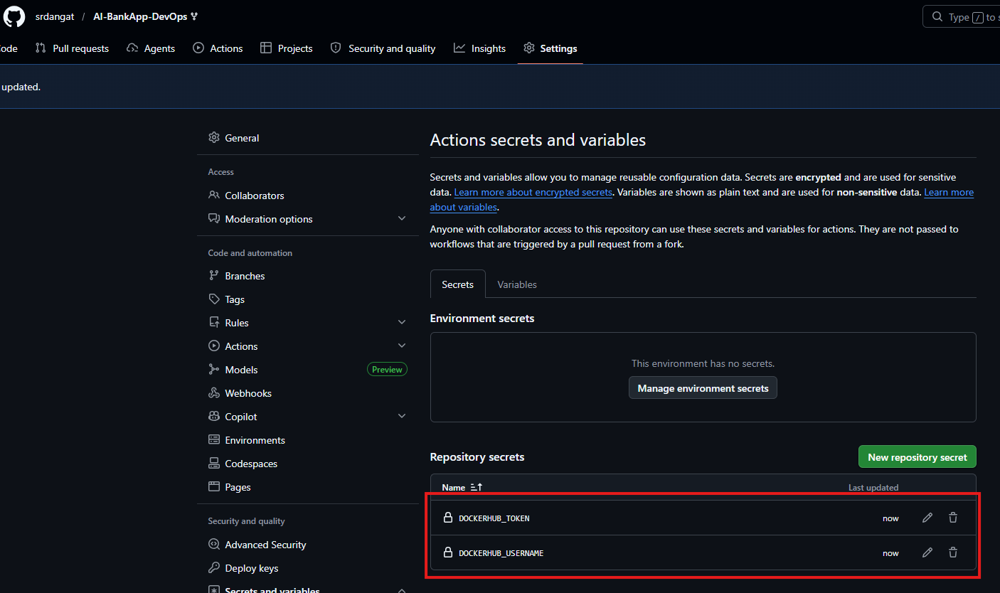

**4. Update the workflow to push to your DockerHub repo:**
Edit `.github/workflows/gitops-ci.yml` in your fork:
```yaml
env:
  DOCKERHUB_REPO: <your-dockerhub-username>/ai-bankapp-eks
```

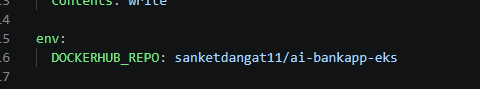

**5. Update the ArgoCD Application to watch your fork:**
```bash
argocd app set bankapp --repo https://github.com/<your-username>/AI-BankApp-DevOps.git
```

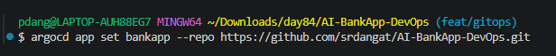

**6. Update the Kubernetes deployment to pull from your DockerHub:**
Edit `k8s/bankapp-deployment.yml`:
```yaml
image: <your-dockerhub-username>/ai-bankapp-eks:latest
```

Commit and push all changes to your fork's `feat/gitops` branch.

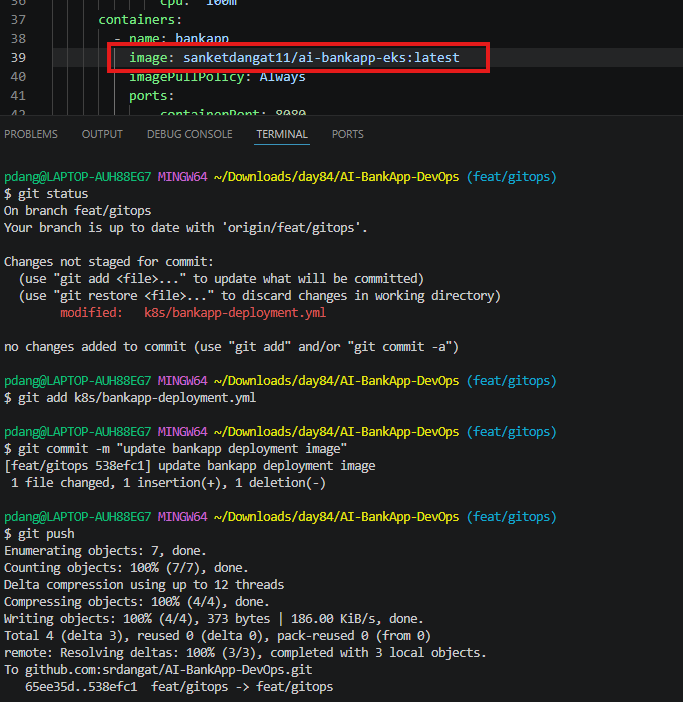


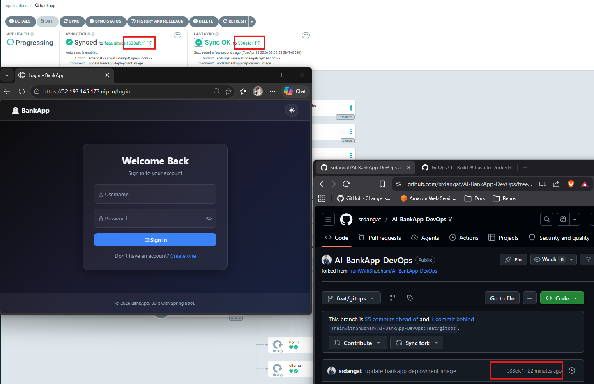

---

### Task 3: Trigger the Full Pipeline
Make a visible code change in the application. Edit a file in `src/`:

For example, edit `src/main/resources/templates/fragments/layout.html` -- change the page title or footer text to include your name:
```html
<!-- Find the title or footer and add your touch -->
<title>AI BankApp - Built by YourName</title>
```

Commit and push:
```bash
git add src/
git commit -m "feat: customize app title"
git push origin feat/gitops
```

**Watch the pipeline:**
1. Go to your fork > Actions tab
2. The "GitOps CI - Build & Push to DockerHub" workflow should be running
3. Watch each step: build -> test -> push -> update manifest -> commit

**After the pipeline completes:**
- Check the last commit on your `feat/gitops` branch -- you should see a commit from `github-actions[bot]` with the message `ci: update bankapp image to <sha> [skip ci]`
- The `k8s/bankapp-deployment.yml` file now has the new image tag

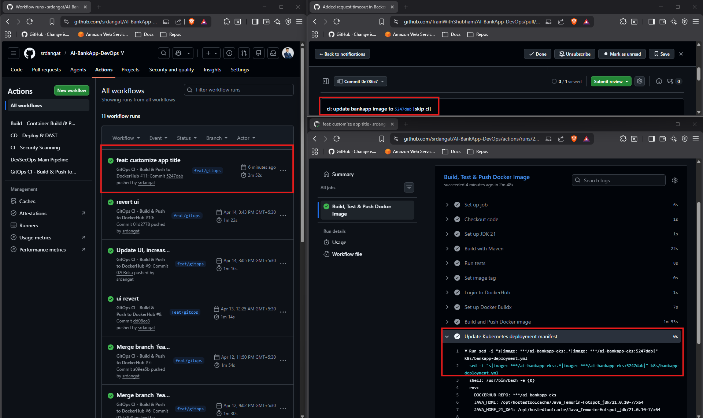

**Watch ArgoCD sync:**
```bash
argocd app get bankapp --refresh
argocd app wait bankapp
```

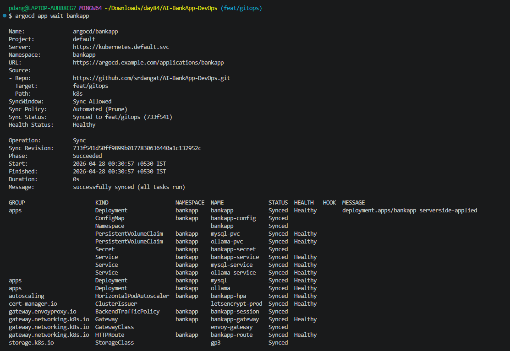

Or watch in the ArgoCD UI -- you will see a new sync event with the updated revision.

Check the pods:
```bash
kubectl get pods -n bankapp -w
```

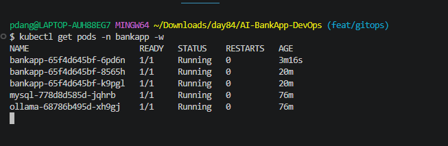

You should see a rolling update -- new pods starting with the new image while old pods terminate gracefully.

Verify the change is live:
```bash
kubectl port-forward svc/bankapp-service -n bankapp 8080:8080
```

Open `http://localhost:8080` and confirm your title change is visible.

**You just completed a full GitOps cycle:** code change -> CI builds image -> updates manifest -> ArgoCD deploys to production. Zero manual intervention.

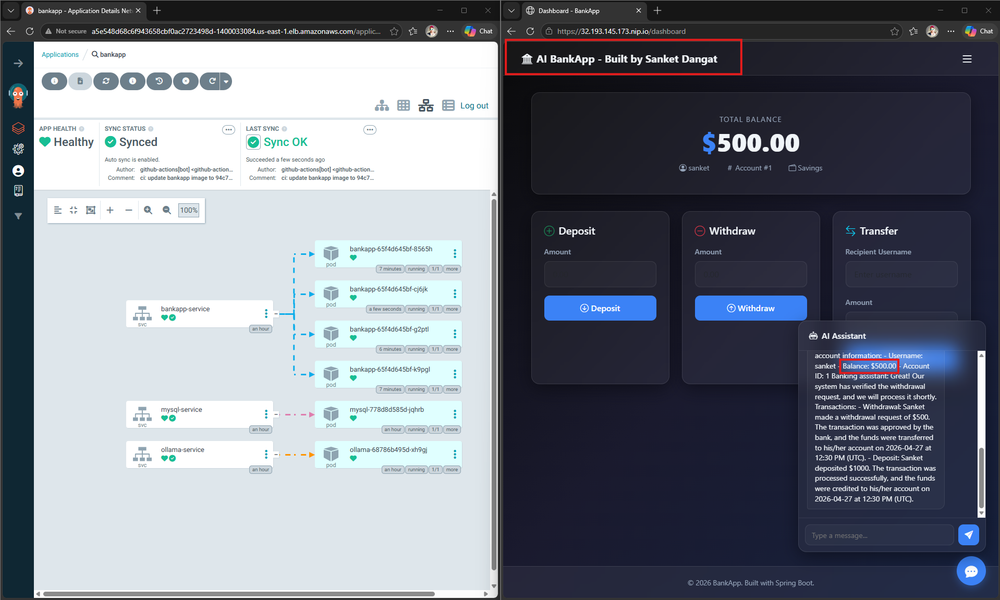

---

### Task 4: Test Drift Detection and Recovery
GitOps means the cluster must always match Git. Test what happens when someone makes unauthorized changes.

**Scenario 1 -- Someone scales down the app directly:**
```bash
kubectl scale deployment bankapp -n bankapp --replicas=1
```

Check ArgoCD:
```bash
argocd app get bankapp
```

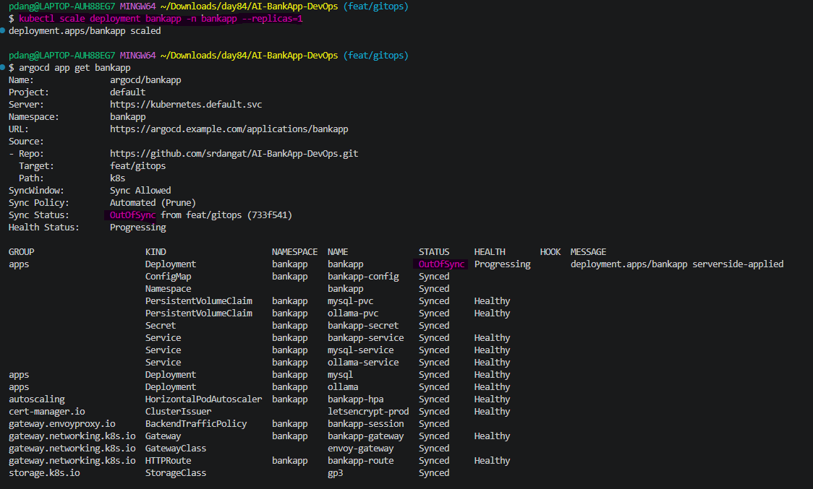

Status should show `OutOfSync`. With `selfHeal: true`, ArgoCD will correct it within 3 minutes. Monitor:
```bash
kubectl get pods -n bankapp -w
```

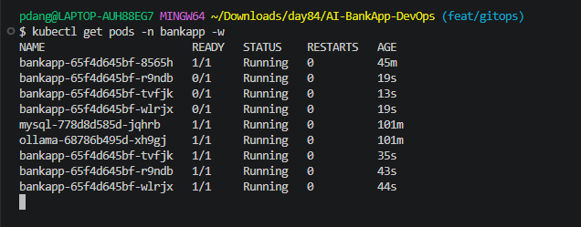

The replica count will return to 4 (or whatever the manifest specifies).

**Scenario 2 -- Someone updates the image tag directly:**
```bash
kubectl set image deployment/bankapp bankapp=nginx:latest -n bankapp
```

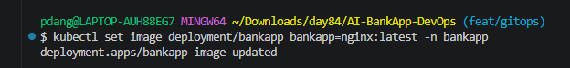

ArgoCD detects the drift and reverts it to the image tag from Git. The BankApp pods restart with the correct image.

**Scenario 3 -- Someone deletes a critical resource:**
```bash
kubectl delete service bankapp-service -n bankapp
```

ArgoCD recreates it from Git.

**View all drift events:**
```bash
argocd app history bankapp
```

In the ArgoCD UI, click the application and look at the "Events" tab. Every self-heal action is logged with the before/after state.


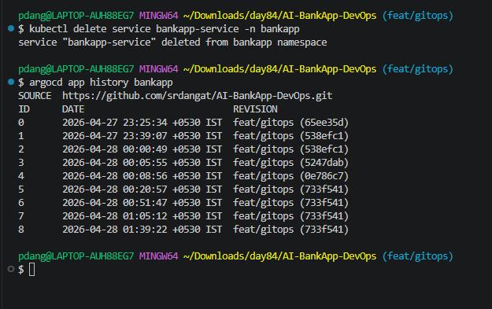
**Document:** In each scenario, how long did ArgoCD take to detect and fix the drift? What would happen if `selfHeal` was disabled?

**Drift Detection and Recovery**

* In all scenarios (scaling, image change, resource deletion), Argo CD detected drift within **~10–30 seconds** and marked the app as **OutOfSync**.
* With `selfHeal: true`, Argo CD automatically synced the app and restored the correct state within **~1–3 minutes** (including pod restart time if needed).

---

### **If `selfHeal` is disabled**

* Argo CD will **detect drift but not fix it**.
* The application remains **OutOfSync** until a manual sync is triggered (`argocd app sync`).
* Incorrect state (wrong replicas, image, or missing resources) will persist.

---

### Task 5: Reflect on the Complete DevOps Pipeline
Step back and look at everything you have built across the entire 90-day challenge that connects to this GitOps pipeline:

```
[Developer writes code]
    |
[Git push to GitHub]  ........... Day 22-28: Git & GitHub
    |
[GitHub Actions CI]   ........... Day 40-49: GitHub Actions
    |-- Build with Maven
    |-- Run tests
    |-- Build Docker image  ..... Day 29-37: Docker
    |-- Push to DockerHub
    |-- Update K8s manifest
    |-- Commit back to Git
    |
[ArgoCD detects change] ........ Day 84-86: GitOps
    |
[ArgoCD syncs to EKS]  ........ Day 81-83: EKS
    |-- Rolling update
    |-- Health checks pass
    |-- HPA scales as needed ... Day 78-80: Helm (HPA, values)
    |
[Prometheus scrapes metrics] ... Day 73-77: Observability
    |-- Grafana dashboards
    |-- Alerts if something breaks
    |
[App is live with zero downtime]
```

Every block in this challenge connects to the next. This is what a DevOps pipeline looks like in production.

---

### Task 6: Complete Teardown
**Delete everything. This is the end of the EKS and ArgoCD block.**

Delete ArgoCD applications:
```bash
argocd app delete bankapp --cascade -y
argocd app delete monitoring --cascade -y 2>/dev/null
argocd app delete envoy-gateway --cascade -y 2>/dev/null
argocd app delete root-app --cascade -y 2>/dev/null
```

The `--cascade` flag tells ArgoCD to delete all Kubernetes resources managed by each application.

Wait for cleanup:
```bash
kubectl get all -n bankapp 2>/dev/null
kubectl get all -n monitoring 2>/dev/null
```

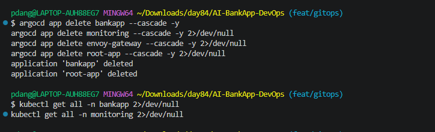

**Destroy the EKS cluster with Terraform:**
```bash
cd AI-BankApp-DevOps/terraform
terraform destroy
```
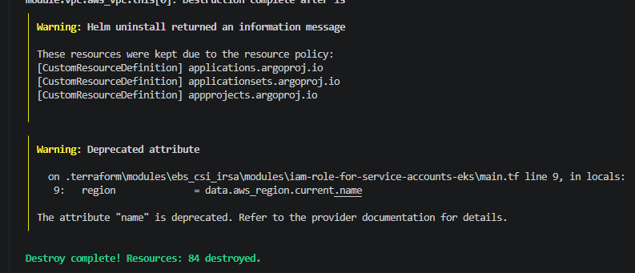

Confirm deletion (type `yes`). This takes 10-15 minutes.

**Verify in the AWS Console:**
- EKS: no clusters
- EC2: no instances, no load balancers, no EBS volumes
- VPC: the `bankapp-eks` VPC is gone
- IAM: clean up roles with `eksctl` or `bankapp-eks` in the name


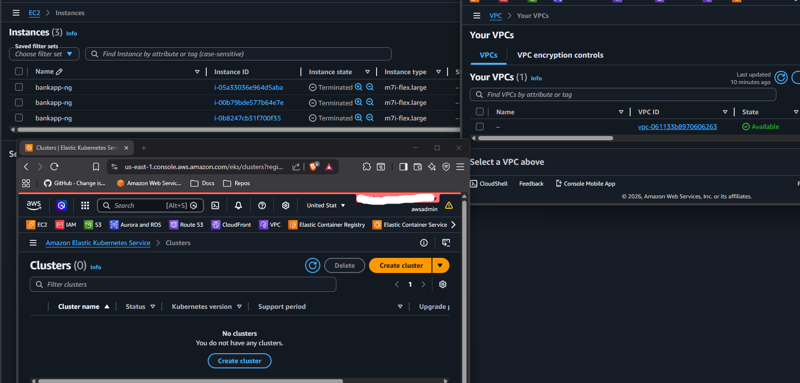


**Final cost check:** Review AWS Billing Dashboard. All EKS charges should stop within the hour.

**Map the 3-day ArgoCD journey:**

| Day | What You Built |
|-----|---------------|
| 84 | ArgoCD setup, first GitOps deploy, self-healing |
| 85 | Sync waves, rollbacks, App of Apps, notifications, RBAC |
| 86 | Full CI/CD pipeline, code-to-production, drift detection, teardown |

---

**The complete GitOps pipeline diagram (code -> CI -> Git -> ArgoCD -> EKS)**

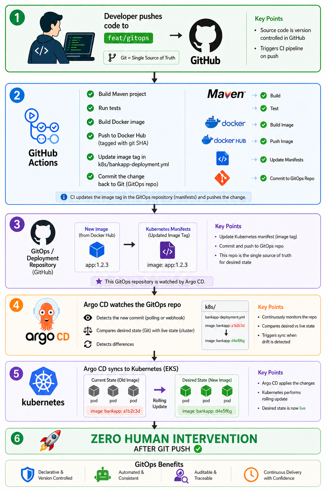

**GitHub Actions workflow explained step by step**

1. `Workflow Name`
```yaml
name: GitOps CI - Build & Push to DockerHub`
```
- This is just the label shown in GitHub Actions UI.

2. `When does it run?`
```yaml
on:
  push:
    branches: [feat/gitops]
    paths:
      - 'src/**'
      - 'pom.xml'
      - 'Dockerfile'
  workflow_dispatch:
```
- Trigger conditions:
- Runs automatically when:
- Code is pushed to branch feat/gitops
- AND changes are in:
```yaml
src/ folder
pom.xml
Dockerfile
```
- Also supports manual trigger from GitHub UI (workflow_dispatch)
- This avoids unnecessary builds when unrelated files change.

3. `Permissions`
```yaml
permissions:
  contents: write
```
- Gives the workflow permission to: `Commit changes` & `Push updates back to the repository`
- Needed for updating the Kubernetes YAML file later.

4. `Environment Variables`
```yaml
env:
  DOCKERHUB_REPO: sanketdangat11/ai-bankapp-eks
```
- Defines a reusable variable:
- Docker image repo name
- Used later when tagging and pushing images.

5. `Job Definition`
```yaml
jobs:
  build-and-push:
    runs-on: ubuntu-latest
```
- Creates a job named build-and-push
- Runs on a fresh Ubuntu virtual machine

6. `Step-by-Step`

`Step 1:` Checkout Code
```yaml
- uses: actions/checkout@v4
```
- Downloads your repository code into the runner.

`Step 2`: Set up Java 21
```yaml
- uses: actions/setup-java@v4
  with:
    java-version: '21'
    distribution: 'temurin'
    cache: 'maven'
```
- Installs Java 21
- Uses Temurin JDK
- Enables Maven dependency caching (faster builds)

`Step 3`: Build Application
```yaml
run: ./mvnw clean package -DskipTests -B
```
- Cleans previous builds
- Compiles code
- Packages into JAR
- Skips tests (-DskipTests)

`Step 4`: Run Tests
```yaml
run: ./mvnw test -B
  continue-on-error: true
```
- Executes unit tests
- Even if tests fail → workflow continues
- This does NOT fail the pipeline on test failure

`Step 5`: Generate Image Tag
```yaml
id: tag
  run: echo "sha_short=$(git rev-parse --short HEAD)" >> "$GITHUB_OUTPUT"
```
- Gets short Git commit SHA (e.g., a1b2c3)
- Saves it as output variable
- Used for versioned Docker image tags

`Step 6`: Login to DockerHub
```yaml
- uses: docker/login-action@v3
  with:
    username: ${{ secrets.DOCKERHUB_USERNAME }}
    password: ${{ secrets.DOCKERHUB_TOKEN }}
```
- Authenticates with DockerHub
- Uses GitHub Secrets (secure)

`Step 7`: Setup Docker Buildx
```yaml
uses: docker/setup-buildx-action@v3
```
- Enables advanced Docker build features
- Required for caching and multi-platform builds

`Step 8`: Build & Push Docker Image
```yaml
- uses: docker/build-push-action@v6
  with:
    context: .
    push: true
    tags: |
      repo:latest
      repo:sha
    cache-from: type=gha
    cache-to: type=gha,mode=max
```
- Builds Docker image from Dockerfile
- Tags it: latest <commit-sha>
- Pushes to DockerHub
- Uses GitHub cache for faster builds
 
`Step 9:` Update Kubernetes Manifest
```yaml
sed -i "s|image: repo:.*|image: repo:sha|" k8s/bankapp-deployment.yml
```
- Replaces old image tag with new SHA tag
- Updates deployment YAML
- This is the GitOps part

`Step 10:` Commit & Push Changes
```yaml
git config user.name "github-actions[bot]"
git config user.email "github-actions[bot]@users.noreply.github.com"
git add k8s/bankapp-deployment.yml
git diff --staged --quiet || git commit -m "ci: update image"
git push
```
- Configures Git identity
- Adds modified file
- Commits only if there are changes
- Pushes back to repo

**The full DevOps pipeline map (connecting all blocks from the challenge)**
```
[Developer writes code]
    |
[Git push to GitHub]  ........... Day 22-28: Git & GitHub
    |
[GitHub Actions CI]   ........... Day 40-49: GitHub Actions
    |-- Build with Maven
    |-- Run tests
    |-- Build Docker image  ..... Day 29-37: Docker
    |-- Push to DockerHub
    |-- Update K8s manifest
    |-- Commit back to Git
    |
[ArgoCD detects change] ........ Day 84-86: GitOps
    |
[ArgoCD syncs to EKS]  ........ Day 81-83: EKS
    |-- Rolling update
    |-- Health checks pass
    |-- HPA scales as needed ... Day 78-80: Helm (HPA, values)
    |
[Prometheus scrapes metrics] ... Day 73-77: Observability
    |-- Grafana dashboards
    |-- Alerts if something breaks
    |
[App is live with zero downtime]
```

**Key takeaways from the 3-day GitOps block**

* Git is the **main control point** (source of truth)
* System always tries to match **Git (desired) vs cluster (actual)**
* You **only update Git**, not the cluster directly
* After pushing code, **deployment happens automatically**
* ArgoCD **continuously checks and syncs** the system
* If something breaks, it **fixes it automatically (self-healing)**
* CI **builds the app**, ArgoCD **deploys it**
* You can **roll back easily** using `git revert`
* Supports **auto deploy or manual approval**
* Maintains **correct deployment order** (DB → app)
* **Small mistakes in Git can cause big issues**
* Debug by checking **Git vs running system**
* Can manage **multiple apps easily**
* **Access control keeps teams safe**
---